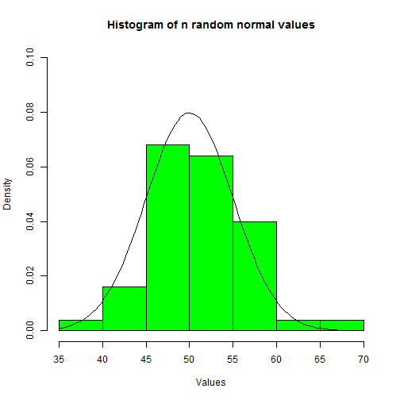

## Normal Distribution Shiny Application

This application allows the user to enter the following:

1. Mean (from 0 to 100), 
2. Standard deviation (from 1 to 10), and 
3. Sample size, n, using a slider (from 30 to 200). 

The output will include:

1. A coefficient of variation estimate generated from the entered mean and stdev and
2. A histogram of a random sample of n values generated from the specified mean, stdev, and sample size.

Note: The histogram will have an overlaid normal density function.

--- .class #id 

The ui.R file looks like this:


```r
library(shiny)

shinyUI(fluidPage(
    numericInput(inputId='Mean', 'Enter the mean (values from 0 to 100):', 50, 
                 min = 0, max = 100, step = 1),
    numericInput(inputId='Stdev', 'Enter the standard deviation (values from 1 to 10):', 5, 
                 min = 1, max = 10, step = 1),
    h4('Coefficient of Variation = Stdev/Mean*100:'),
    verbatimTextOutput("CoV"),
    sliderInput(inputId="num",
                label="Choose a sample size n (from 30 to 200)",
                value=50,min=30,max=200),
    
    plotOutput("hist")
))
```

--- .class #id 

The server.R file looks like this:


```r
library(shiny)

covar <- function(Mean,Stdev) {round(Stdev/Mean*100,2)}

shinyServer(function(input,output){
    output$CoV <- renderPrint({covar(input$Mean,input$Stdev)})
    output$hist <- renderPlot({
        title <- "Histogram of n random normal values"
        hist(rnorm(input$num, mean=input$Mean, sd=input$Stdev),xlab="Values",
             col="green",main=title,prob=TRUE)
        curve(dnorm(x, mean=input$Mean, sd=input$Stdev), add=TRUE)
    })
})
```

--- 
See the following links to run the application:

https://www.shinyapps.io/admin/#/application/75467

https://jdhuffaker.shinyapps.io/JHU_Developing_Data_Products_Project2

### 
For a mean of 50, stdev of 5, and sample size of 50, the output looks like this:

 

